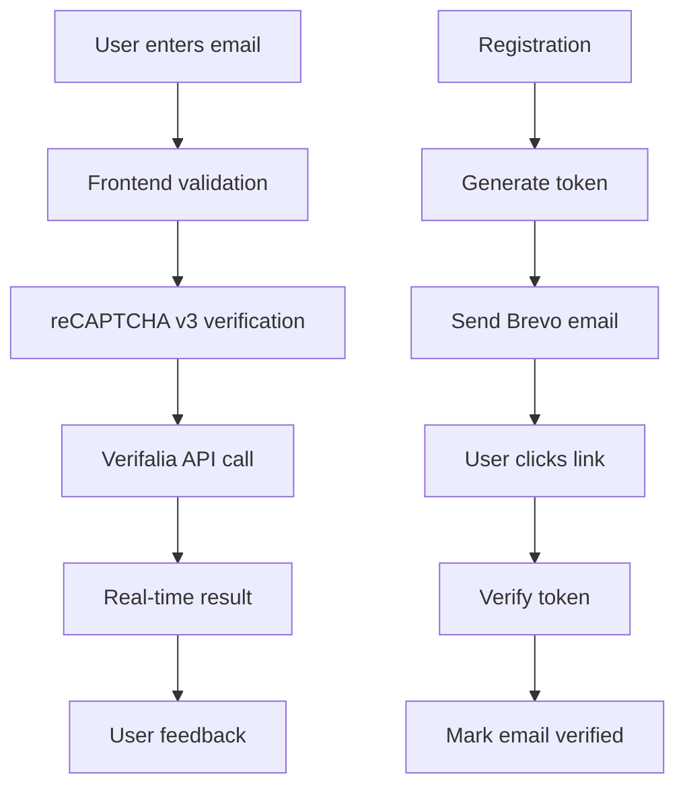

# 🎯 Verifalia Email Verification Integration Guide

Complete implementation guide for integrating [Verifalia email verification](https://github.com/verifalia/verifalia-js-sdk) with your Pizza Platform.

---

## 📋 **Manual Setup Steps (REQUIRED)**

### **Step 1: Create Verifalia Account**

1. 🌐 Visit [verifalia.com](https://verifalia.com) and **Sign Up**
2. ✅ **Verify your email address**
3. 📊 **Access your Verifalia dashboard**

### **Step 2: Create User Account (CRITICAL SECURITY)**

1. 🔐 In your Verifalia dashboard, navigate to **"Users & User Accounts"**
2. ➕ Click **"Add User Account"**
3. 📝 Configure your user account with **specific permissions**:
   ```
   Name: Pizza Platform API User
   Username: pizza-platform-api (choose your own)
   Password: [auto-generated or custom]
   
   ✅ REQUIRED PERMISSIONS:
   - emailValidations:submit (Submit verification jobs)
   - emailValidations:get (Retrieve verification results)  
   - emailValidations:delete (Clean up completed jobs)
   - credits:get (Check credit balance)
   - credits:listDailyUsages (Monitor usage statistics)
   
   ⚠️ OPTIONAL PERMISSIONS:
   - emailValidations:export (CSV/Excel exports)
   - emailValidations:list (List all jobs)
   
   ❌ AVOID THESE (for security):
   - users:* (user management)
   - billingInformation:* (billing access)
   - adminSettings:* (administrative functions)
   ```
4. 💾 **SAVE THESE CREDENTIALS** (you'll need them):
   - **Username**: `pizza-platform-api` (what you chose)
   - **Password**: `[the generated/chosen password]`

### **Step 3: Update Configuration**

1. 📁 Open `config.env` in your project root
2. 🔧 Update the Verifalia configuration:
   ```env
   # Verifalia Email Verification Configuration
   VERIFALIA_SUB_ACCOUNT_SID=your-username-here
   VERIFALIA_AUTH_TOKEN=your-password-here
   ```
   **Note**: Despite the variable names, these now hold your **username** and **password**
3. 💾 **Save the file**

---

## 🚀 **Implementation Overview**

### **What's Been Implemented**

✅ **Backend Services:**
- `EmailVerificationService` - Core Verifalia integration
- `recaptchaService` - Centralized reCAPTCHA handling
- Email verification routes (`/api/email/*`)

✅ **Frontend Integration:**
- Real-time email validation utility
- Business/Admin login page integration
- User feedback and suggestions

✅ **Security Features:**
- reCAPTCHA v3 Enterprise protection
- Rate limiting for verification requests
- Secure token generation for email verification
- Privacy-conscious logging

---

## 🔧 **Technical Architecture**

### **Email Verification Flow**



### **API Endpoints**

| Endpoint | Method | Purpose |
|----------|--------|---------|
| `/api/email/verify-address` | POST | Real-time email verification |
| `/api/email/send-verification` | POST | Send verification email |
| `/api/email/verify/:token` | GET | Verify email with token |
| `/api/email/verification-status/:userId` | GET | Check verification status |
| `/api/email/service-stats` | GET | Service statistics (admin) |

---

## 🧪 **Testing Your Integration**

### **Step 1: Test Real-Time Verification**

1. 🚀 Start your server:
   ```bash
   npm start
   # or
   node backend/src/backend.js
   ```

2. 🌐 Open business login page:
   ```
   http://localhost:7000/pages/business-login.html
   ```

3. 📧 Test different email types:
   - **Valid email**: `test@gmail.com`
   - **Invalid email**: `invalid@nonexistentdomain.com`
   - **Risky email**: `test@tempmail.com`

4. 👀 **Check console logs** for verification results

### **Step 2: Test API Directly**

Use curl or Postman to test the verification endpoint:

```bash
curl -X POST http://localhost:7000/api/email/verify-address \
  -H "Content-Type: application/json" \
  -d '{
    "email": "test@gmail.com"
  }'
```

**Expected Response:**
```json
{
  "success": true,
  "email": "test@gmail.com",
  "isValid": true,
  "isRisky": false,
  "classification": "Deliverable",
  "suggestions": [],
  "timestamp": "2024-01-15T10:30:00.000Z"
}
```

### **Step 3: Test Email Verification Flow**

1. 📧 Send verification email:
   ```bash
   curl -X POST http://localhost:7000/api/email/send-verification \
     -H "Content-Type: application/json" \
     -d '{
       "email": "your-test-email@gmail.com"
     }'
   ```

2. 📬 **Check your email** for verification link
3. 🔗 **Click the verification link**
4. ✅ **Confirm email is marked as verified**

---

## 📊 **Monitoring & Statistics**

### **Check Service Health**

```bash
curl http://localhost:7000/api/email/service-stats
```

**Response includes:**
- Verifalia credit balance
- API rate limits
- Service configuration status
- Usage statistics

### **Console Logs to Monitor**

- `✅ Verifalia email verification service initialized`
- `📧 Verifying email with Verifalia: example@email.com`
- `✅ Email verification completed: example@email.com - Deliverable`
- `🛡️ reCAPTCHA Enterprise score: 0.9 for action: EMAIL_VERIFY`

---

## 💰 **Cost Management**

### **Free Tier Limits**
- **25 verification credits daily**
- Resets every 24 hours
- Perfect for development and testing

### **Rate Limits**
- **18 requests per second** per IP
- **Burst limit**: 45 requests per second
- Frontend caching reduces API calls

### **Production Recommendations**
- Purchase credit packs: ~$0.001-0.003 per verification
- Monitor usage via Verifalia dashboard
- Implement intelligent caching strategies

---

## 🛡️ **Security Features**

### **reCAPTCHA v3 Enterprise Integration**
- **Action-based verification**: `EMAIL_VERIFY`
- **Risk scoring**: 0.5 threshold for legitimate users
- **Automatic fallback**: Continues without reCAPTCHA if unavailable

### **Rate Limiting**
- **Email verification**: 5 attempts per 15 minutes
- **Email resend**: 3 attempts per hour
- **IP-based protection**

### **Privacy Protection**
- **Email sanitization** in logs
- **Secure token generation** (32-byte random)
- **Token expiration** (24 hours)
- **One-time use tokens**

---

## 🔧 **Configuration Options**

### **Environment Variables**

```env
# Required
VERIFALIA_SUB_ACCOUNT_SID=your-sub-account-sid
VERIFALIA_AUTH_TOKEN=your-auth-token

# Optional (for enhanced security)
RECAPTCHA_SITE_KEY=your-recaptcha-site-key
RECAPTCHA_SECRET_KEY=your-recaptcha-secret-key
GOOGLE_CLOUD_PROJECT_ID=your-project-id

# Email (Brevo SMTP)
EMAIL_HOST=smtp-relay.brevo.com
EMAIL_PORT=587
EMAIL_USER=your-brevo-user
EMAIL_PASS=your-brevo-password
```

### **Frontend Configuration**

```javascript
// Initialize email validator
const emailValidator = new EmailInputValidator(emailInput, {
  validateOnBlur: true,     // Validate when user leaves field
  validateOnType: false,    // Don't validate while typing
  showSuggestions: true,    // Show email suggestions
  debounceDelay: 500       // Delay for typing validation
});
```

---

## 🚨 **Troubleshooting**

### **Common Issues & Solutions**

#### **1. "Verifalia not configured" Warning**
- ✅ Check `config.env` has correct credentials
- ✅ Ensure credentials are not placeholder values
- ✅ Restart server after config changes

#### **2. "reCAPTCHA verification failed"**
- ✅ Verify reCAPTCHA site key in `config.env`
- ✅ Check Google Cloud project ID
- ✅ Ensure reCAPTCHA Enterprise is enabled

#### **3. "Email verification service unavailable"**
- ✅ Check Verifalia account credits
- ✅ Verify API credentials are active
- ✅ Check network connectivity

#### **4. "Rate limit exceeded"**
- ✅ Wait for rate limit reset (15 minutes)
- ✅ Implement caching to reduce API calls
- ✅ Consider upgrading Verifalia plan

### **Debug Mode**

Enable verbose logging by setting:
```env
NODE_ENV=development
```

This will show detailed verification results and API responses.

---

## 📈 **Performance Optimization**

### **Caching Strategy**
- **Frontend cache**: 5-minute TTL
- **Result caching**: Reduces duplicate API calls
- **Intelligent retry**: Handles temporary failures

### **User Experience**
- **Non-blocking validation**: Never prevents form submission
- **Progressive enhancement**: Works without JavaScript
- **Graceful degradation**: Continues if service unavailable

---

## 🎯 **Next Steps**

### **Production Deployment**
1. 🔐 **Create production Verifalia sub-account**
2. 🌐 **Update production environment variables**
3. 📊 **Set up monitoring and alerting**
4. 💳 **Purchase appropriate credit packs**

### **Advanced Features**
1. 📋 **Bulk email verification for existing users**
2. 📊 **Analytics dashboard integration**
3. 🔄 **Automated credit top-up**
4. 📧 **Custom email templates**

---

## 🆘 **Support Resources**

### **Verifalia Documentation**
- [JavaScript SDK](https://github.com/verifalia/verifalia-js-sdk)
- [API Reference](https://verifalia.com/developers)
- [Classification Guide](https://verifalia.com/developers/core-concepts)

### **Integration Support**
- [Verifalia Support](https://verifalia.com/help)
- Email: support@verifalia.com
- Response time: Usually within 24 hours

---

## ✅ **Implementation Checklist**

- [ ] ✅ Created Verifalia account
- [ ] ✅ Set up sub-account with API access
- [ ] ✅ Updated `config.env` with credentials
- [ ] ✅ Tested real-time email verification
- [ ] ✅ Tested email verification flow
- [ ] ✅ Verified console logs show success
- [ ] ✅ Checked service statistics endpoint
- [ ] ✅ Configured rate limiting appropriately
- [ ] ✅ Set up monitoring for production

**🎉 Congratulations! Your Verifalia email verification is fully integrated and ready for production!**
